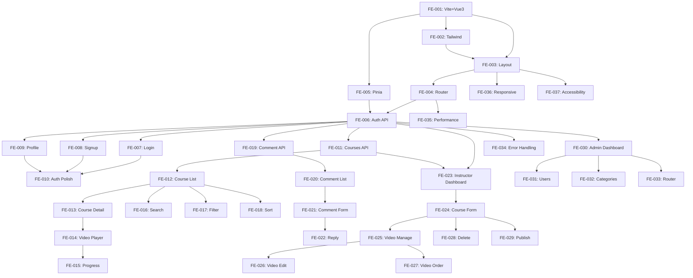

# Vue 3 SPA Frontend - 実装チケット一覧

## 概要

FastAPIバックエンドを利用するVue 3ベースのSPAフロントエンドの実装チケット。

## フェーズ別チケット

### Phase 1: 基盤構築 (FE-001 ~ FE-005)

| チケット | タイトル | 優先度 | 状態 | 推定時間 |
|---------|---------|--------|------|---------|
| FE-001 | Vite + Vue 3 プロジェクトセットアップ | High | TODO | 1.5h |
| FE-002 | Tailwind CSS + DaisyUI セットアップ | High | TODO | 1.5h |
| FE-003 | レイアウトコンポーネント実装 | High | TODO | 2h |
| FE-004 | Vue Router 設定 | High | TODO | 1.5h |
| FE-005 | Pinia ストア設定 | High | TODO | 1h |

### Phase 2: 認証機能 (FE-006 ~ FE-010)

| チケット | タイトル | 優先度 | 状態 | 推定時間 |
|---------|---------|--------|------|---------|
| FE-006 | 認証APIクライアント実装 | High | TODO | 2h |
| FE-007 | ログインページ実装 | High | TODO | 2.5h |
| FE-008 | サインアップページ実装 | High | TODO | 3h |
| FE-009 | プロフィールページ実装 | Medium | TODO | 2h |
| FE-010 | 認証機能の仕上げとテスト | High | TODO | 2.5h |

### Phase 3: コア機能 (FE-011 ~ FE-018)

| チケット | タイトル | 優先度 | 状態 | 推定時間 |
|---------|---------|--------|------|---------|
| FE-011 | コースAPIクライアント実装 | High | TODO | 2h |
| FE-012 | コース一覧ページ実装 | High | TODO | 3h |
| FE-013 | コース詳細ページ実装 | High | TODO | 3h |
| FE-014 | 動画プレイヤーコンポーネント実装 | High | TODO | 2.5h |
| FE-015 | 視聴進捗管理実装 | High | TODO | 2h |
| FE-016 | 高度な検索機能 | Medium | TODO | 1.5h |
| FE-017 | カテゴリーフィルター強化 | Medium | TODO | 1h |
| FE-018 | ソート機能 | Low | TODO | 1h |

### Phase 4: インタラクティブ機能 (FE-019 ~ FE-022)

| チケット | タイトル | 優先度 | 状態 | 推定時間 |
|---------|---------|--------|------|---------|
| FE-019 | コメントAPI・ストア実装 | Medium | TODO | 2h |
| FE-020 | コメント表示コンポーネント | Medium | TODO | 2h |
| FE-021 | コメント投稿フォーム | Medium | TODO | 1.5h |
| FE-022 | 講師返信機能 | Medium | TODO | 1h |

### Phase 5: 講師機能 (FE-023 ~ FE-029)

| チケット | タイトル | 優先度 | 状態 | 推定時間 |
|---------|---------|--------|------|---------|
| FE-023 | 講師ダッシュボード | High | TODO | 2h |
| FE-024 | コース作成・編集フォーム | High | TODO | 3h |
| FE-025 | 動画管理画面 | Medium | TODO | 2h |
| FE-026 | 動画編集フォーム | Medium | TODO | 2h |
| FE-027 | ドラッグ&ドロップ順序変更 | Low | TODO | 2h |
| FE-028 | コース削除機能 | Medium | TODO | 1h |
| FE-029 | 公開/非公開切り替え | Medium | TODO | 1h |

### Phase 6: 管理者機能 (FE-030 ~ FE-033)

| チケット | タイトル | 優先度 | 状態 | 推定時間 |
|---------|---------|--------|------|---------|
| FE-030 | 管理者ダッシュボード | Medium | TODO | 2h |
| FE-031 | ユーザー管理画面 | Medium | TODO | 2.5h |
| FE-032 | カテゴリー管理画面 | Medium | TODO | 2h |
| FE-033 | 管理者Router設定 | Medium | TODO | 0.5h |

### Phase 7: 仕上げ (FE-034 ~ FE-037)

| チケット | タイトル | 優先度 | 状態 | 推定時間 |
|---------|---------|--------|------|---------|
| FE-034 | エラーハンドリング改善 | High | TODO | 2h |
| FE-035 | パフォーマンス最適化 | Medium | TODO | 2h |
| FE-036 | レスポンシブデザイン改善 | High | TODO | 2.5h |
| FE-037 | アクセシビリティ改善 | Medium | TODO | 2h |

## 合計

- **総チケット数**: 37
- **推定総作業時間**: 約70時間

## チケットファイル構成

```
frontend/docs/tickets/
├── FE-001-setup.md                     # Phase 1: 基盤構築
├── FE-002-tailwind-setup.md
├── FE-003-layout.md
├── FE-004-router.md
├── FE-005-store.md
├── FE-006-auth-api.md                  # Phase 2: 認証
├── FE-007-login-page.md
├── FE-008-signup-page.md
├── FE-009-profile-page.md
├── FE-010-auth-polish.md
├── FE-011-courses-api.md               # Phase 3: コア機能
├── FE-012-course-list-page.md
├── FE-013-course-detail-page.md
├── FE-014-video-player.md
├── FE-015-video-progress.md
├── FE-016-018-search-features.md       # FE-016~018まとめ
├── FE-019-022-comments.md              # Phase 4: FE-019~022まとめ
├── FE-023-029-instructor.md            # Phase 5: FE-023~029まとめ
├── FE-030-033-admin.md                 # Phase 6: FE-030~033まとめ
└── FE-034-037-polish.md                # Phase 7: FE-034~037まとめ
```

## 技術スタック

- **フレームワーク**: Vue 3 (Composition API)
- **ビルドツール**: Vite 5.x
- **ルーティング**: Vue Router 4
- **状態管理**: Pinia 2.x
- **HTTP通信**: Axios 1.x
- **CSS**: Tailwind CSS v4 + DaisyUI 4.4.19
- **YouTube**: IFrame API
- **開発言語**: JavaScript (TypeScript移行は将来的に検討)

## 依存関係



## 実装の進め方

### 推奨順序

1. **Phase 1 (FE-001~005)**: 基盤を完全に構築
2. **Phase 2 (FE-006~010)**: 認証機能を完成させる
3. **Phase 3 (FE-011~015)**: コア機能（コース表示・動画再生・進捗）を実装
4. **Phase 3 (FE-016~018)**: 検索・フィルター機能を追加（優先度低め）
5. **Phase 4 (FE-019~022)**: コメント機能を実装
6. **Phase 5 (FE-023~029)**: 講師機能を実装
7. **Phase 6 (FE-030~033)**: 管理者機能を実装（最後でも可）
8. **Phase 7 (FE-034~037)**: 仕上げ・最適化

### MVP (Minimum Viable Product) スコープ

最小限のリリースには以下が必要:

- **Phase 1**: 全て (FE-001~005)
- **Phase 2**: 全て (FE-006~010)
- **Phase 3**: FE-011~015 のみ（検索・フィルターは後回し可）
- **Phase 5**: FE-023~024 のみ（コース作成・編集のみ）

**MVP推定時間**: 約30時間

## 注意事項

- 各チケットの詳細は `tickets/` ディレクトリ内の個別ファイルを参照
- 優先度: High > Medium > Low
- FE-016~018, FE-019~022, FE-023~029, FE-030~033, FE-034~037 はまとめファイルで管理
- すべてのチケットは Vue 3 + Composition API を使用
- `<script setup>` 構文を標準とする
- TypeScriptへの移行は将来的に検討（現在はJavaScript）
